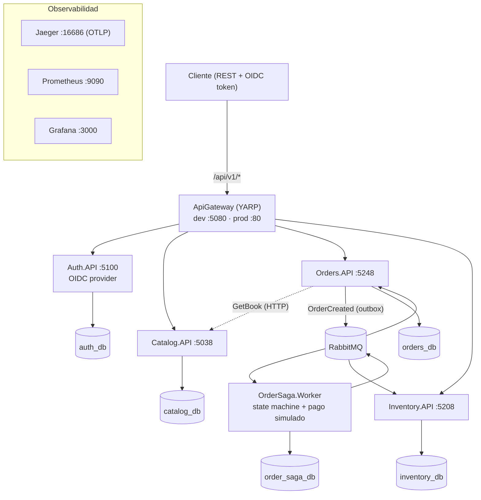

# bookstore-microservices

**Microservicios de una librería online en .NET 10 con Clean Architecture**: un sistema completo y desplegable compuesto por 5 APIs + una saga orquestada por mensajes, con autenticación OpenID Connect, resiliencia, observabilidad y pipeline CI/CD.

---

## Badges

| CI (main) | Stack |
|---|---|
| [](https://github.com/richcrd/bookstore-microservices/actions/workflows/ci.yml) |      |

> _Banner / demo del producto: pendiente de añadir._

## Tabla de contenidos

- [Features](#features)
- [Arquitectura](#arquitectura) · [detalle](docs/architecture.md)
- [Requisitos previos](#requisitos-previos)
- [Quickstart (desarrollo)](#quickstart-desarrollo)
- [Configuración](#configuración)
- [Uso / API](#uso--api)
- [Estructura del proyecto](#estructura-del-proyecto)
- [Testing](#testing)
- [Deploy / CI-CD](#deploy--ci-cd)
- [Observabilidad](#observabilidad)
- [Fases de desarrollo](docs/phases.md) · [Arquitectura de detalle](docs/architecture.md)
- [Changelog](#changelog)
- [Contributing](#contributing)
- [Licencia](#licencia)

## Features

- **Un solo punto de entrada**: gateway YARP que enruta `/api/v1/*` y los endpoints OIDC (`/connect/*`, `/.well-known/*`) a los servicios internos (y reescribe destinos en prod).
- **Autenticación OpenID Connect** centralizada (`Auth.API` actúa de **proveedor OIDC** con OpenIddict — Authorization Code + PKCE para SPA, *password*/*refresh* para clientes confidenciales; **el gateway y los servicios** validan los tokens por *discovery*, y las rutas `orders`/`stock-items` exigen token **en el borde** — 401 sin él — mientras `catalog` y `auth` siguen públicas).
- **Rate limiting en el gateway**: fixed window **20 req/15 s por IP** (`QueueLimit 0`); al superarlo responde **429** con `Retry-After: 15`.
- **Saga distribuida** con `MassTransit` + patrón **Outbox/Inbox** transaccional (sin pérdida ni duplicado de mensajes).
- **Resiliencia**: reintentos exponenciales y circuit breaker (`Microsoft.Extensions.Http.Resilience`/Polly).
- **Idempotencia**: header `Idempotency-Key` en `POST /orders` (retry seguro sin duplicar pedidos).
- **Migraciones de esquema automáticas** en el arranque de cada servicio (EF Core).
- **Observabilidad**: OpenTelemetry → Jaeger (trazas), Prometheus + Grafana (métricas `/metrics`).
- **Docker de producción**: multi-stage, compose con Postgres/RabbitMQ propios y solo `:80` expuesto.
- **CI/CD**: GitHub Actions (build+test en cada push) y deploy por tags `v*`.
- **94 tests** (unit + integración con Testcontainers).

## Arquitectura

> **Documento completo**: [docs/architecture.md](docs/architecture.md) — componentes, enrutado YARP, mensajería y contratos, saga paso a paso, outbox/inbox, persistencia, observabilidad y despliegue.



**Flujo típico**: el cliente obtiene un token con su flujo OIDC (Authorization Code + PKCE desde el SPA o *password grant* desde la CLI) → crea un pedido (Orders valida contra Catalog con el snapshot de precio) → el evento viaja por el outbox a RabbitMQ → la saga coordina pago (simulado) → Inventory reserva y descuenta stock → el pedido pasa a `Shipped`.

### Frontend (SPA)

La interfaz web (React) **vive fuera del monorepo** (carpeta local del autor `~/Desktop/BookStoreWeb`) y se conecta al backend **solo a través del gateway**:

- **Arranque**: `npm run dev` en `http://localhost:5173`; el gateway habilita CORS para ese origen (política `Frontend`).
- **Login**: `customer/customer123` (rol `customer`) o `admin/admin123` (rol `admin`), con el flujo OIDC de Authorization Code + PKCE (cliente `web-spa`) contra `http://localhost:5080`.
- **Configuración**: se define por entorno con `VITE_GATEWAY_URL` y `VITE_OIDC_CLIENT_ID` (`.env`/`.env.production`; plantilla en `.env.example`) — **configuración, no secretos**; la seguridad del flujo reside en Authorization Code + PKCE (cliente público `web-spa`).
- **Carrito y paginación**: el carrito persiste en `localStorage` (clave `bookstore.cart`) y el checkout crea el pedido con `Idempotency-Key`; la home busca con debounce y los listados de libros/pedidos pagan con el componente `Pagination`.
- **API**: todas las llamadas pasan por el gateway `http://localhost:5080` (`/api/v1/*` y endpoints OIDC `/connect/*`, `/.well-known/*`).

## Requisitos previos

- [.NET SDK 10](https://dotnet.microsoft.com/download)
- [Docker Desktop](https://www.docker.com/products/docker-desktop/)
- PostgreSQL 17 y RabbitMQ 4 (recomendado: vía Docker, ver Quickstart)
- Puertos libres (tabla abajo)

| Puerto | Uso |
|---|---|
| 5038 / 5248 / 5208 / 5100 / 5080 | Servicios (dev) |
| 5432 / 5672 | Postgres / RabbitMQ |
| 16686 / 9090 / 3000 | Jaeger / Prometheus / Grafana |

## Quickstart (desarrollo)

1. **Clonar** el repositorio:
   ```bash
   git clone https://github.com/richcrd/bookstore-microservices.git
   cd bookstore-microservices
   ```

2. **Levantar la infraestructura** (Postgres + RabbitMQ):
   ```bash
   docker run -d --name bookstore-postgres \
     -e POSTGRES_USER=postgres -e POSTGRES_PASSWORD=postgres -p 5432:5432 postgres:17-alpine
   docker run -d --name bookstore-rabbitmq -p 5672:5672 -p 15672:15672 rabbitmq:4-management
   ```

3. **Compilar**:
   ```bash
   dotnet build BookStore.slnx
   ```

4. **Arrancar los servicios** (cada uno en su terminal; las migraciones EF se aplican solas al iniciar):
   ```bash
   ASPNETCORE_URLS=http://localhost:5100 dotnet run --project src/Services/Auth/Auth.API
   ASPNETCORE_URLS=http://localhost:5038 dotnet run --project src/Services/Catalog/Catalog.API
   ASPNETCORE_URLS=http://localhost:5248 dotnet run --project src/Services/Orders/Orders.API
   ASPNETCORE_URLS=http://localhost:5208 dotnet run --project src/Services/Inventory/Inventory.API
   dotnet run --project src/Services/OrderSaga/OrderSaga.Worker
   ASPNETCORE_URLS=http://localhost:5080 dotnet run --project src/ApiGateway/ApiGateway
   ```

5. **Swagger** en `http://localhost:<puerto>/swagger` por cada servicio (o por el gateway sin `/swagger`).

6. **(Opcional) Observabilidad**:
   ```bash
   docker compose -f docker/docker-compose.observability.yml up -d
   ```

## Configuración

| Variable | Default | Descripción |
|---|---|---|
| `ConnectionStrings__CatalogDb` | `Host=localhost;Database=catalog_db;Username=postgres;Password=postgres` | BD de catálogo |
| `ConnectionStrings__OrdersDb` | `Host=localhost;Database=orders_db;...` | BD de órdenes |
| `ConnectionStrings__InventoryDb` | `Host=localhost;Database=inventory_db;...` | BD de stock |
| `ConnectionStrings__OrderSagaDb` | `Host=localhost;Database=order_saga_db;...` | BD de la saga |
| `RabbitMQ__Host` | `rabbitmq://localhost` | Broker de mensajería (en prod `rabbitmq://rabbitmq`) |
| `CatalogApi__BaseAddress` | `http://localhost:5038` | HTTP a Catalog usado por Orders |
| `OpenIddict__Issuer` | `http://localhost:5080` | Issuer público del proveedor OIDC; **los servicios y el gateway** lo usan para descubrir claves y validar el `iss` (en dev es el Host del gateway; en prod default `http://auth:5100` resoluble en la red interna; para dominios reales sobreescribe con `BOOKSTORE_PUBLIC_ISSUER`) |
| `OpenIddict__SpaClientId`/`SpaRedirectUri` | `web-spa` / `http://localhost:5173/callback` | Cliente público SPA (Authorization Code + PKCE) sembrado al arrancar |
| `OpenIddict__CliClientId`/`CliClientSecret` | `cli` / `cli-dev-secret` | Cliente confidencial para la CLI (*password*/*refresh* grant) |
| `OpenTelemetry__Endpoint` | `http://localhost:4317` | Endpoint OTLP (Jaeger) |
| `ReverseProxy__Clusters__<name>__Destinations__<dest>__Address` | `http://localhost:<puerto>` | Destinos YARP por servicio (sobrescritos en prod) |

> ⚠️ Los secretos (`OpenIddict__Issuer` público, `CliClientSecret` y contraseñas de BD) deben venir de *secrets* en producción (GitHub Secrets / Docker secrets / Vault); los valores de `appsettings.json` son de **desarrollo**.

## Uso / API

La documentación completa de cada contrato está en el **Swagger** de cada servicio. Endpoints principales tras el gateway:

| Método | Ruta | Servicio |
|---|---|---|
| POST | `/connect/token` · `/connect/authorize` · `/connect/logout` | Auth (endpoints OIDC) |
| GET | `/.well-known/openid-configuration` · `/.well-known/jwks` | Auth (discovery) |
| GET/POST | `/api/v1/books`, `/api/v1/categories` | Catalog |
| GET/POST/PATCH | `/api/v1/orders/...` | Orders |
| GET/POST | `/api/v1/stock-items/...` | Inventory |

Las rutas `orders` y `stock-items` exigen **token Bearer** (el gateway valida en el borde y responde **401** sin token); `books`, `categories`, `/connect/*` y `/.well-known/*` son públicas. El gateway aplica además **rate limiting** de 20 peticiones/15 s por IP (429 con `Retry-After: 15`).

**Credenciales demo**: `admin/admin123` (rol `admin`) y `customer/customer123` (rol `customer`).

```bash
# Discovery OIDC a través del gateway
curl -s http://localhost:5080/.well-known/openid-configuration

# Token con el cliente confidencial "cli" (password grant)
TOKEN=$(curl -s -X POST http://localhost:5080/connect/token \
  -d "grant_type=password&client_id=cli&client_secret=cli-dev-secret&username=customer&password=customer123&scope=openid profile roles offline_access" \
  | jq -r .access_token)

# Crear pedido (idempotente: misma Idempotency-Key → mismo pedido)
curl -s -X POST http://localhost:5080/api/v1/orders \
  -H "Authorization: Bearer $TOKEN" \
  -H "Idempotency-Key: $(uuidgen)" \
  -H "Content-Type: application/json" \
  -d '{"customerId":"22222222-2222-2222-2222-222222222222",
       "items":[{"bookId":"<bookId>","quantity":1}]}'
```

## Estructura del proyecto

```
src/
├── ApiGateway/                        # Punto único de entrada (YARP + rutas)
├── BuildingBlocks/SharedKernel/       # OpenIddict (validación), telemetría y utilidades compartidas
└── Services/
    ├── Auth/Auth.API/                 # Proveedor OpenID Connect (login, tokens y discovery)
    ├── Catalog/                       # Catálogo: API + Application + Domain + Infrastructure
    ├── Orders/                        # Órdenes: API + Application + Domain + Infrastructure
    ├── Inventory/                     # Stock: API + Application + Domain + Infrastructure
    └── OrderSaga/OrderSaga.Worker/    # Saga state machine + pago simulado
tests/                                 # Tests unit y de integración por servicio
docker/                                # Dockerfiles + compose (dev, observabilidad, prod)
.github/workflows/                     # CI (build+test) y CD (deploy por tags)
```

Cada servicio sigue **Clean Architecture** (Dominio → Application → Infrastructure → API) con su propio DbContext y migraciones EF.

## Testing

```bash
dotnet test BookStore.slnx
```

- **Unit**: domain + application de cada servicio.
- **Integración**: `WebApplicationFactory` + **Testcontainers** (Postgres efímero) — requiere Docker en el runner.

## Deploy / CI-CD

- **CI** (`.github/workflows/ci.yml`): en cada push/PR a `main` → `dotnet restore/build/test`. Estado: [](https://github.com/richcrd/bookstore-microservices/actions/workflows/ci.yml)
- **CD** (`.github/workflows/cd.yml`): al crear un tag `v*` → SSH al servidor → `docker compose build` + `up -d` del stack de producción.

Necesita secrets en el repo: `SERVER_HOST`, `SERVER_USER`, `SSH_PRIVATE_KEY` y la variable `DEPLOY_DIR`.

**Stack de producción** (`docker/docker-compose.prod.yml`): 9 contenedores (Postgres + RabbitMQ propios, 6 servicios y el gateway) con el gateway publicado en **`:80`**.

Historial completo de **fases construidas** (qué se añadió, qué no y por qué) en [docs/phases.md](docs/phases.md).

## Observabilidad

| Herramienta | URL | Qué ver |
|---|---|---|
| Jaeger | `http://localhost:16686` | Trazas distribuidas end-to-end (una orden completa). |
| Prometheus | `http://localhost:9090` | Métricas `/metrics` scrapeadas cada 10s (+ `Status → Targets`). |
| Grafana | `http://localhost:3000` (`admin/admin`) | Dashboards sobre el datasource Prometheus provisionado. |

Ejemplo de query Prometheus: `rate(http_server_request_duration_seconds_count[5m])` o filtrada por servicio con `{service_name="Orders.API"}`.

## Changelog

El historial de cambios sigue [Keep a Changelog](CHANGELOG.md) + Conventional Commits y el proyecto respeta [SemVer](https://semver.org/lang/es/).

## Contributing

Ver [CONTRIBUTING.md](CONTRIBUTING.md). Regla básica: **Conventional Commits** + `feat:`/`fix:`/`chore:` y descripción clara en cada PR; los cambios de infraestructura y contratos requieren revisión explícita.

## Licencia

Distribuido bajo la [licencia MIT](LICENSE), © 2026 Richard Rodriguez.

La seguridad y forma de reportar vulnerabilidades se documentan en [SECURITY.md](SECURITY.md); el historial de cambios en [CHANGELOG.md](CHANGELOG.md).