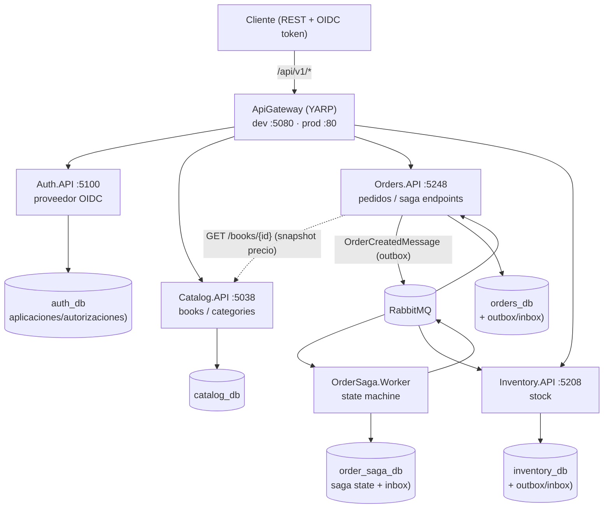
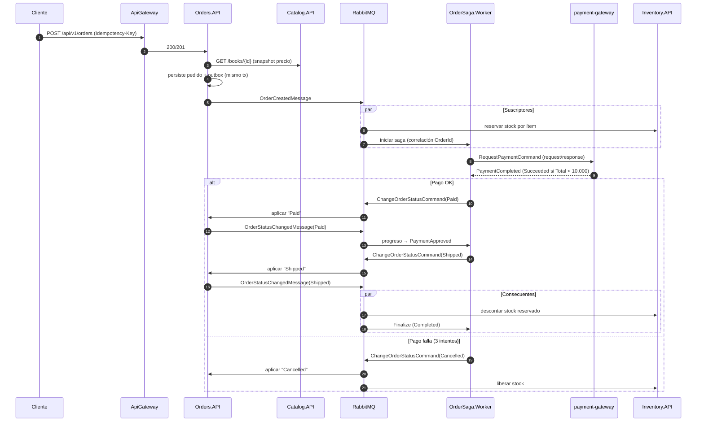
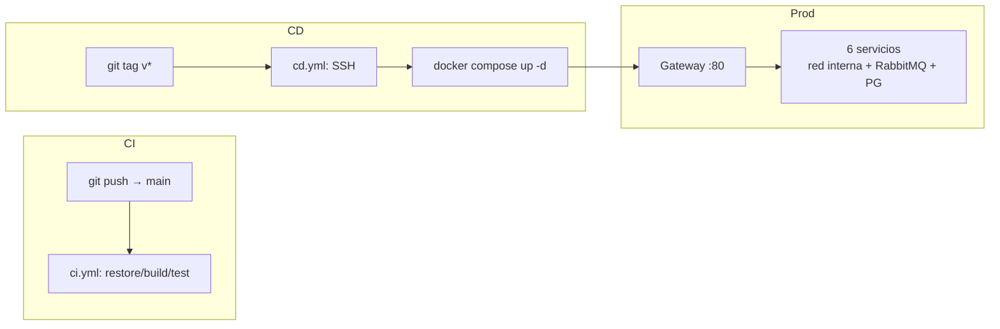

# Arquitectura — bookstore-microservices

| | |
|---|---|
| **Estado** | En evolución (activo) |
| **Fecha** | 2026-08-29 |
| **Propietario** | Richard Rodriguez |
| **Contacto** | fam.castro99@gmail.com |
| **Enlaces** | [README](../README.md) · [CONTRIBUTING](../CONTRIBUTING.md) · [CHANGELOG](../CHANGELOG.md) · [SECURITY](../SECURITY.md) |

## 1. Resumen ejecutivo

Plataforma de librería online compuesta por **5 servicios** (4 APIs + 1 worker de saga) y un **gateway único**, construida en .NET 10 con Clean Architecture. El proceso central —la **orden de compra**— se orquesta mediante una **saga distribuida** sobre RabbitMQ con patrón **outbox/inbox** transaccional, garantizando consistencia eventual sin pérdida ni duplicado de mensajes.

Objetivos arquitectónicos: un único punto de entrada, desacople por mensajería, idempotencia en los puntos de fallo, resiliencia (reintentos/circuit breaker) y observabilidad end-to-end (trazas + métricas).

## 2. Principios de diseño

1. **Contratos antes que implementación**: las APIs se consumen por contratos HTTP (`/api/v1/*`) y los servicios se desacoplan por mensajes tipados (`SharedKernel.Messages`).
2. **Dependencias hacia dentro** (Clean Architecture): Domain → Application → Infrastructure → API; nunca al revés.
3. **Fallo de mensajería ≠ pérdida de datos**: transactional outbox/inbox; los consumidores son idempotentes.
4. **Deliverability**: reintentos exponenciales y circuit breaker para llamadas HTTP salientes.
5. **Observable por defecto**: OpenTelemetry (trazas) y `/metrics` (Prometheus) en todos los servicios.
6. **Entornos reproducibles**: esquema auto-migrado por EF, infraestructura por Docker y despliegues por pipeline (CI/CD).

## 3. Vista de alto nivel



## 4. Componentes

| Componente | Rol | Puerta de entrada |
|---|---|---|
| **ApiGateway** | Punto único de entrada (YARP), enrutado, **validación OIDC en el borde y rate limiting global** | `:5080` dev / `:80` prod (único puerto público) |
| **Auth.API** | **Proveedor OpenID Connect** (OpenIddict): login, emisión de tokens y *discovery* | `/connect/*` · `/.well-known/*` |
| **Catalog.API** | Catálogo de libros y categorías | `/api/v1/books/*`, `/api/v1/categories/*` |
| **Orders.API** | Creación y estados de pedidos, productor/consumidor de mensajes | `/api/v1/orders/*` |
| **Inventory.API** | Stock: reserva, descuento y liberación | `/api/v1/stock-items/*` |
| **OrderSaga.Worker** | Saga de pedidos + **payment-gateway** (consumidor simulado) | sin HTTP (worker) |
| **RabbitMQ** | Broker de mensajería | `:5672` (gestión `:15672`) |
| **PostgreSQL** | 4 bases (una por servicio con datos) | `:5432` |

## 5. Enrutado del gateway (YARP)

Rutas definidas en `src/ApiGateway/appsettings.json`:

| Ruta | Cluster (servicio) | Destino | Autorización |
|---|---|---|---|
| `/api/v1/books/{**catch-all}` | `catalog` → `catalog-1` | `http://catalog:5038/` *(prod)* | pública |
| `/api/v1/categories/{**catch-all}` | `catalog` | ídem | pública |
| `/api/v1/orders/{**catch-all}` | `orders` → `orders-1` | `http://orders:5248/` | `authenticated` |
| `/api/v1/stock-items/{**catch-all}` | `inventory` → `inventory-1` | `http://inventory:5208/` | `authenticated` |
| `/connect/{**catch-all}` | `auth` → `auth-1` | `http://auth:5100/` | pública (IdP) |
| `/.well-known/{**catch-all}` | `auth` | ídem | pública (IdP) |

Los endpoints **OIDC** (`/connect/*`, `/.well-known/*`) se exponen por el gateway para que clientes y validadores resuelvan *discovery* y emisión de tokens. El issuer (`OpenIddict__Issuer`) por defecto en prod es la dirección interna `http://auth:5100` (resoluble en la red Docker); para exposiciones tras un dominio real, define `BOOKSTORE_PUBLIC_ISSUER=https://tudominio.com` (todos los servicios y auth apuntarán al mismo issuer). En dev el issuer es `http://localhost:5080` (el Host público del gateway).

Las rutas OIDC (`/connect/{**catch-all}`, `/.well-known/{**catch-all}`) llevan el transform **`RequestHeaderOriginalHost: true`**: YARP reenvía a Auth conservando el Host original de la petición (en dev `localhost:5080`), de modo que los endpoints **relativos** de OIDC y el documento de *discovery* se resuelven contra el Host público del gateway y no contra el destino interno. El gateway define además la política CORS **`Frontend`** (`AllowedOrigins=["http://localhost:5173"]`, `AllowAnyHeader`/`AllowAnyMethod`) para que el SPA React pueda consumirlo desde su origen de desarrollo.

Las rutas **`orders`** e **`inventory`** llevan `AuthorizationPolicy: authenticated` (`RequireAuthenticatedUser`): el gateway valida el token **en el borde** (mismo `AddIdpAuthentication` de SharedKernel, `OpenIddict.Validation`) y responde **401** antes de reenviar al servicio destino; `catalog-*`, `auth-connect` y `auth-wellknown` no llevan política (públicas por la semántica de cada servicio: lectura de catálogo y endpoints del IdP). En dev el gateway declara `OpenIddict__Issuer: http://localhost:5080` y proxya su propio `/.well-known` hacia Auth (*bootstrap* sin bucle: el edge valida `iss` contra su propio Host público).

En el stack de producción las direcciones se inyectan por entorno (`ReverseProxy__Clusters__*__Destinations__*__Address`), porque dentro del *overlay network* de Docker los contenedores se resuelven por **nombre de servicio**, no por `localhost`.

## 6. Comunicación síncrona

Solo hay una llamada síncrona significativa: al crear un pedido, **Orders.API consulta a Catalog.API** (`GET /books/{id}`) para validar el libro y **hacer snapshot del precio** en el pedido (configurable en `CatalogApi__BaseAddress`). El pedido almacena su propio `Total`/`Currency` para no depender del catálogo a futuro.

- Resiliente: `Microsoft.Extensions.Http.Resilience` (reintentos exponenciales + circuit breaker).
- El resto de interacciones entre servicios es asíncrona por RabbitMQ (diseño orientado a eventos).

## 7. Mensajería y contratos

Todos los contratos viven en `src/BuildingBlocks/SharedKernel/Messages/OrderMessages.cs` (registros inmutables). **APIs públicas del bus**:

| Mensaje | Publica | Consumen | Propósito |
|---|---|---|---|
| `OrderCreatedMessage(OrderId, CustomerId, Total, Currency, OccurredOn, Items)` | Orders (creación) | Saga (inicio) + Inventory (reserva) | Comunicar pedido creado |
| `OrderStatusChangedMessage(OrderId, CustomerId, OldStatus, NewStatus, OccurredOn, Items)` | Orders (transición de estado) | Saga (progreso) + Inventory (descuento/liberación) | Comunicar cambio de estado |
| `RequestPaymentCommand(OrderId, Amount, Currency)` | Saga → `queue:payment-gateway` | payment-gateway | Solicitar cargo (request/response, timeout 0) |
| `PaymentCompleted(OrderId, Succeeded, Reason)` | payment-gateway | Saga | Resultado del pago |
| `ChangeOrderStatusCommand(OrderId, NewStatus)` | Saga | Orders | Ordenar cambio de estado |

Topología de consumidores:

- **Orders.API**: `ChangeOrderStatusCommandConsumer` → `UpdateOrderStatusCommand`.
- **Inventory.API**: `OrderCreatedConsumer` (**reserva** cada item) y `OrderStatusChangedConsumer` (**descuenta** en `Shipped`, **libera** en `Cancelled`).
- **OrderSaga.Worker**: `OrderSagaStateMachine` en `OrderCreatedMessage` y `OrderStatusChangedMessage`; `PaymentGatewayConsumer` atiende `RequestPaymentCommand`.

## 8. Saga de pedido

Orquestación en `OrderSaga.Worker/OrderSagaStateMachine.cs`, persistida en `order_saga_db` (tabla `saga-state`) y correlacionada por `OrderId`. Estados: `AwaitingPayment → PaymentApproved → ShipmentRequested → Completed` (o `Cancelled`), con hasta **3 intentos de pago**.

El **payment-gateway es simulado** (`PaymentGatewayConsumer`): duerme 250 ms y responde `Succeeded` si `Amount < 10.000`.



Reglas de negocio que condicionan la arquitectura:

- **Reserva temprana**: el stock se reserva al *crear* el pedido (no al pagar) y se libera si se **cancela**.
- **Descuento**: solo al pasar a `Shipped`.
- **Estados**: `Pending → Paid → Shipped` (compra) o `Pending → Cancelled`.
- La compensación (liberar stock) es automática vía `OrderStatusChangedMessage(Cancelled)`.

## 9. Outbox / Inbox (MassTransit)

- **Outbox transaccional**: al guardar el agregado se persisten los mensajes en `OutboxMessage` dentro de la **misma transacción** que el pedido; MassTransit los entrega tras el commit (no hay ventana sin mensaje).
- **Inbox**: los consumidores deduplican mensajes (idempotencia *at least once*) vía `InboxState`, evitando efectos laterales duplicados (p. ej. doble descuento de stock).
- Tablas sufijadas por base: Orders (Creación/Órdenes), Inventory e OrderSaga tienen su propio outbox/inbox; la saga usa además `saga-state`.

→ El contrato de mensajes es un **convenio estable**: modificarlo es breaking y requiere versión + ADR (ver [CONTRIBUTING](../CONTRIBUTING.md#mensajería-y-sagas)).

## 10. Resiliencia

- **HTTP (Orders→Catalog)**: reintentos exponenciales + circuit breaker (`Microsoft.Extensions.Http.Resilience`).
- **Mensajería**: reintento interno del bus + redelivery; además retry del pago (hasta 3) en la saga.
- **Idempotencia**: consumidores idempotentes + header `Idempotency-Key` en la creación de pedidos (ver §11).

## 11. Idempotencia en la creación de pedidos

`POST /api/v1/orders` acepta `Idempotency-Key` (GUID) en el encabezado:

1. 1.ª vez con una clave → **201** y pedido persistido con su `IdempotencyKey` (índice único).
2. Retry con la misma clave → **200**, devolviendo el **mismo pedido** (sin duplicar).
3. Sin clave → se genera un GUID internamente.

Garantiza que reintentos de red por timeout no dupliquen pedidos ni reservas.

## 12. Seguridad y autenticación

- **OpenID Connect / OAuth 2.0** con **OpenIddict 7**: `Auth.API` es el **proveedor de identidad** (issuer `OpenIddict__Issuer`). Clientes sembrados al arranque:
  - `web-spa` (público): **Authorization Code + PKCE** + refresh para el frontend; `post_logout_redirect_uri` registrado (`http://localhost:5173/`).
  - `cli` (confidencial, `CliClientSecret`): **password grant** + refresh para la CLI/scripts.
  - Tokens RS256 (firmados con certificado de desarrollo; HTTPS + certificado real pendiente en prod), vida 30 min, refresh 14 días.
  - **Cierre de sesión**: `GET/POST /connect/logout` (`AuthorizationController.Logout()`) ejecuta `SignOutAsync` sobre el esquema de OpenIddict y redirige a `post_logout_redirect_uri` (o `/`).
- **Validación por *discovery***: Catalog/Orders/Inventory y el **ApiGateway** usan `OpenIddict.Validation` → descargan el documento de discovery del issuer y validan `iss`/firma/claves (sin firma compartida hardcodeada).
- **Auth en el borde (gateway)**: el ApiGateway exige token con la política `authenticated` en las rutas `orders` e `inventory` (**401** temprano sin token, sin reemplazar la validación por discovery del servicio destino); `catalog` y `auth` se mantienen públicas. Issuer dev del gateway `http://localhost:5080` (su `/.well-known` proxya a Auth, *bootstrap* sin bucle).
- **Rate limiting global en el gateway**: fixed window **20 req/15 s por IP** (`QueueLimit 0` → sin cola), **429** con `Retry-After: 15`; implementación extraída a `RateLimitPolicies.CreateGlobalLimiter()` y cubierta por `tests/ApiGateway.UnitTests` (2 tests: rechazo al superar el límite y partición por IP).
- **Roles**: `admin`/`customer` viajan en el claim `role` y las políticas de autorización usan `RequireClaim("role", ...)` (`AdminOnly` para inventario y otras operaciones protegidas).
- **Secrets por entorno (Fase 21, 12-factor)**: `appsettings.json` **no contiene credenciales** — placeholders `CHANGE_ME` que rompen el arranque a propósito (fail-fast) en `ConnectionStrings.*` y `OpenIddict__CliClientSecret`, y `AuthUsers.Users` vacío. Las credenciales de desarrollo (`Password=postgres`, usuarios demo `admin/admin123`/`customer/customer123`, `CliClientSecret: cli-dev-secret`) viven en **`appsettings.Development.json`** (por servicio; el de Auth incluye una propiedad `"_comment"` explicativa) y solo se cargan con `ASPNETCORE_ENVIRONMENT=Development` (`dotnet run`/tests). En QA/prod los secretos llegan por **variables de entorno** con la precedencia estándar de ASP.NET Core (env `Config__Clave` > `appsettings.{Environment}.json` > `appsettings.json` > default en código): el compose de prod interpola `${VAR}` desde `docker/.env` (plantilla `docker/.env.prod.example`, gitignored) o desde los `envs:` del CD, y **falla si falta una variable obligatoria**. **No hay usuarios demo en prod por defecto**: se inyectan opcionalmente vía `AuthUsers__Users__N__*`. El catálogo no requiere token para lectura.
- El reverse-proxy expone `/api/v1/*`, `/connect/*` y `/.well-known/*` (con `orders` y `stock-items` protegidos por la política `authenticated` en el borde); el resto no es accesible desde el exterior. El **SPA React** (fuera del monorepo) consume la *discovery* y estos endpoints contra el Host público del gateway (`:5080`).

## 13. Persistencia

5 bases PostgreSQL 17, ownership por servicio (*database per service*):

| Base | Servicio | Particularidad |
|---|---|---|
| `catalog_db` | Catalog.API | 1 migración |
| `orders_db` | Orders.API | 3 migraciones (+ idempotencia, outbox/inbox) |
| `inventory_db` | Inventory.API | 2 migraciones (+ outbox/inbox) |
| `order_saga_db` | OrderSaga.Worker | 1 migración (saga state + inbox) |
| `auth_db` | Auth.API | 1 migración (apps/scopes/autorizaciones OpenIddict) |

- Los servicios con base de datos aplican **`db.Database.Migrate()` al arrancar** (migraciones automáticas); el script `docker/postgres/init/001-create-databases.sql` crea las 5 bases en entornos limpios.
- El dominio de inventario modela `QuantityOnHand`, `ReservedQuantity` y `Available`.

## 14. Observabilidad

Los servicios exportan **trazas, métricas y logs** por OTLP **HTTP/protobuf** al **otel-collector**. En dev el collector es el del stack observability (`docker/docker-compose.observability.yml`, endpoint base `http://localhost:4318`); en **prod** forma parte del propio `docker-compose.prod.yml` y el endpoint es `http://otel-collector:4318` (resolución por nombre de servicio). El collector enruta **trazas → Jaeger** (`:16686`) y **logs → Seq** (`:5341`). En paralelo, `/metrics` (Prometheus) se scrapea junto con **RabbitMQ `:15692`** (`/metrics/per-object`), y **Grafana** (`:3000`, `admin/admin`) sirve dashboards y alertas provisionadas.

```
servicios ──OTLP HTTP :4318──► otel-collector :4317/:4318 ──► Jaeger :16686 (trazas)
     │                          └───────────────────────► Seq :5341 (logs)
     └──/metrics──► Prometheus :9090 ──► Grafana :3000 (dashboards + alertas)
                           ▲
     RabbitMQ :15692 ──────┘
```

- **Telemetría de servicio** (`SharedKernel.Telemetry.TelemetryExtensions.AddServiceTelemetry`): trazas + métricas + **logs** con exportador OTLP HTTP/protobuf explícito. El endpoint base se resuelve por env `OTEL_EXPORTER_OTLP_ENDPOINT` (la inyecta Aspire; en prod la inyecta el compose como `http://otel-collector:4318`) > config `OpenTelemetry:Endpoint` > default `http://localhost:4318`, y los exportadores escriben en el **path por señal** (`OtlpSignalEndpoint`) → `{endpoint.TrimEnd('/')}/v1/traces`, `/v1/metrics` y `/v1/logs`. **El endpoint base se configura sin path; el SDK añade `/v1/{signal}`** (fix de la Fase 20: antes se posteaba a la raíz `4318/` y el receiver `otlp/http` del collector respondía **404**, descartando la telemetría en prod). El worker `OrderSaga.Worker/Program.cs` replica el patrón inline (incluye `WithLogging` OTLP).
- **otel-collector** (`otel/opentelemetry-collector-contrib:0.118.0`): receivers OTLP explícitos en `0.0.0.0:4317` (gRPC) y `0.0.0.0:4318` (HTTP) — en 0.118 el default liga a loopback — con pipelines de trazas → Jaeger y de logs → Seq (`http://seq:80/ingest/otlp`). Ambos composes (dev y prod) montan el mismo `docker/otel-collector.yml`. Los host ports `14317/14318` quedaron descartados.
- **Jaeger** (`jaegertracing/all-in-one:1.76.0`): UI `:16686`; la imagen ya no publica `4317/4318` (solo `16686`); sus antiguos logs OTLP los recibe ahora el collector.
- **Seq** (`datalust/seq:latest`): UI `:5341`, auth deshabilitada (`SEQ_FIRSTRUN_NOAUTHENTICATION`) y volumen `seq-data`.
- **Grafana** (`grafana/grafana:11.4.0`; `admin/admin` en dev, en prod `GF_SECURITY_ADMIN_USER=admin` + `GF_SECURITY_ADMIN_PASSWORD=${GRAFANA_ADMIN_PASSWORD}` — obligatoria desde la Fase 21, sin default `-admin`): datasource Prometheus con **uid fijo `prometheus`**, provider de dashboards (`provisioning/dashboards/provider.yml`) y **2 dashboards provisionados** — `BookStore · API` (uid `bookstore-api`: request rate, latencia p95, error rate 5xx, peticiones activas; template var por `instance`) y `BookStore · RabbitMQ` (uid `bookstore-rabbitmq`: ready/unacked, consumidores, publ/deliv). **Alertas provisionadas** (`provisioning/alerting/`): `rules.yml` con 3 reglas (latencia p95 > 1 s, ratio 5xx > 5 %, colas RabbitMQ > 200), `contact-points.yml` con el receiver **`alert-webhook`** apuntando a **`${GRAFANA_ALERT_WEBHOOK_URL}`** (interpolación de entorno de Grafana; el valor lo inyectan los composes — default `http://host.docker.internal:3001/hooks/none` — y el CD lo propaga en prod desde el secret `GRAFANA_ALERT_WEBHOOK_URL`) y `policies.yml` (`group_by: service_name`) enrutando al receiver `alert-webhook`.
- **Prometheus** (`prom/prometheus:v2.55.0`): en dev (`docker/prometheus.yml`, scrape 10 s) el job `bookstore` scrapea los 5 servicios por `host.docker.internal:<puerto>`; en **prod** (`docker/prometheus.prod.yml`) los targets se resuelven **por nombre de contenedor** del stack (`apigateway:5080`, `auth:5100`, `catalog:5038`, `orders:5248`, `inventory:5208`). Ambos incluyen el **job `rabbitmq`** con `metrics_path /metrics/per-object` (`host.docker.internal:15692` en dev, `rabbitmq:15692` en prod). En prod además: `--config.file` explícito, retención **15 d** (`--storage.tsdb.retention.time=15d`) y volumen `prometheus-data`.
- **Producción** (Fase 20): el `docker-compose.prod.yml` añade los 5 contenedores de observabilidad (collector, Jaeger, Seq, Prometheus y Grafana) con volúmenes `seq-data`/`prometheus-data`/`grafana-data` y sus puertos (`16686`, `5341`, `9090`, `3000`, `4317`, `4318`) publicados **solo para inspección**: el gateway sigue siendo el único puerto público `:80` y en servidores reales el firewall debe mantener únicamente `:80` abierto. El worker de la saga no expone `/metrics` HTTP (no lleva `ASPNETCORE_URLS`), por lo que no aparece en el scrape de Prometheus (sí en Jaeger vía OTLP).
- **Aspire AppHost** (opcional, `src/AppHost/`): `dotnet run --project src/AppHost` orquesta los 6 proyectos con `AddProject<Projects.*>` fijando los puertos HTTP clásicos (`WithHttpEndpoint`: gateway 5080, auth 5100, catalog 5038, orders 5248, inventory 5208, saga) y `WaitFor` en el gateway; inyecta `ConnectionStrings__CatalogDb/OrdersDb/InventoryDb/OrderSagaDb` → `Host=localhost;Port=5432;Database=<db>;...` y `RabbitMQ__Host` → `rabbitmq://localhost:5672` para la infra dev existente (no gestiona contenedores). Su dashboard (`https://localhost:17017`) inyecta `OTEL_EXPORTER_OTLP_ENDPOINT` a los servicios. Requiere `dotnet new install Aspire.ProjectTemplates`; alternativa a los 6 `dotnet run`, no a la vez.
- Instrumentación disponible: HTTP (ASP.NET Core), System.Net.Http, MassTransit, Npgsql y EF Core.

## 15. Despliegue

Dos modos de ejecución equivalentes (no duplicados):

- **Dev** (iteración): 6 procesos `dotnet run` en puertos dedicados + contenedores de infraestructura (`bookstore-postgres`, `bookstore-rabbitmq`, y opcional observabilidad por `docker-compose.observability.yml`); alternativa equivalente: **Aspire AppHost** (`dotnet run --project src/AppHost`) que orquesta los 6 servicios con los mismos puertos reutilizando la infra dev (ver §14).
- **Prod** (`docker/docker-compose.prod.yml`): **13 contenedores** — Postgres/RabbitMQ propios, los 6 proyectos ejecutables (5 servicios + gateway) y **5 de observabilidad** (otel-collector, Jaeger, Seq, Prometheus y Grafana) — en red interna; **único puerto público `:80`** (gateway). Las UIs de observabilidad (`16686`, `5341`, `9090`, `3000`) y los puertos OTLP (`4317`, `4318`) se publican **solo para inspección**; en servidores reales el firewall debe mantener únicamente `:80` abierto. El endpoint OTLP de los servicios es `http://otel-collector:4318` (resolución por nombre de servicio; en dev `http://localhost:4318`). Los destinos YARP se inyectan por variables de entorno; el issuer OIDC (`OpenIddict__Issuer`) por defecto es la dirección interna `http://auth:5100`, resoluble por los servicios dentro de la red Docker; `BOOKSTORE_PUBLIC_ISSUER` lo sobreescribe para exposiciones tras dominio real. El servicio `apigateway` recibe en el compose ese mismo `OpenIddict__Issuer` y `OpenIddict__DisableTransportSecurityRequirement: "true"` (igual que los servicios con validación) para poder validar tokens en el borde dentro de la red.

**Gestión de secretos (Fase 21, 12-factor)**: todos los secretos del stack de prod se interpolan con `${VAR}` desde el entorno del compose — `docker/.env` (plantilla versionada `docker/.env.prod.example`, copiada y gitignored) en arranques manuales, o las variables que inyecta el CD (`env` + `envs:`) en despliegues por pipeline (**sin `.env` en el servidor**). Las variables **obligatorias** (`POSTGRES_PASSWORD`, `RABBITMQ_USER`, `RABBITMQ_PASSWORD`, `CLI_CLIENT_SECRET`, `GRAFANA_ADMIN_PASSWORD`) **no tienen default a propósito**: `docker compose config`/`up` falla si faltan (fail-fast). Opcionales con default: `POSTGRES_USER` (`postgres`), `BOOKSTORE_PUBLIC_ISSUER` (`http://auth:5100`) y `GRAFANA_ALERT_WEBHOOK_URL` (placeholder de alertas). ⚠️ **Rotar `POSTGRES_PASSWORD` en un volumen existente exige `down -v` (destruye los volúmenes) u `ALTER USER` en la BD**: el env de Postgres solo aplica en el primer `init` del volumen.

**CI/CD** (`../../.github/workflows/`):
- `ci.yml`: en cada push/PR a `main` → `dotnet restore` + `build` + `test` (unit + integración con Testcontainers).
- `cd.yml`: al crear un tag `v*` → SSH al servidor → `docker compose build` + `up -d` (requiere secrets `SERVER_HOST`, `SERVER_USER`, `SSH_PRIVATE_KEY` y los **6 secretos de entorno de la Fase 21** — `POSTGRES_PASSWORD`, `RABBITMQ_USER`, `RABBITMQ_PASSWORD`, `CLI_CLIENT_SECRET`, `GRAFANA_ADMIN_PASSWORD`, `GRAFANA_ALERT_WEBHOOK_URL` — más `vars.DEPLOY_DIR`); el paso Deploy inyecta esos 6 por `env` + `envs:` del `appleboy/ssh-action` para que el compose de prod los interpole en la sesión remota.



## 16. Limitaciones y roadmap

- **Payment-gateway simulado** (éxito si `Total < 10.000`): sustituible por un proveedor real sin cambiar la saga (mismo contrato `RequestPaymentCommand`/`PaymentCompleted`).
- **Certificados de desarrollo en OpenIddict** (`AddDevelopmentEncryptionCertificate`): en un despliegue real hay que proveer certificados de firma/cifrado persistentes y expirar a HTTPS.
- **Catálogo sin mensajería** de momento.
- Pendientes: más ADR de decisiones clave en `docs/adr/`, contratos versionados y *contract testing*.
- El **frontend SPA** (React, fuera del monorepo) consume el gateway por Authorization Code + PKCE; la **Fase 16** añadió búsqueda con debounce, **carrito persistente en `localStorage`** (clave `bookstore.cart`, checkout con `Idempotency-Key`), **paginación** de libros/pedidos y **configuración por entorno `VITE_*`** (`.env`, no secretos). La **Fase 18** añadió **seguimiento en vivo**: la página `/orders/:id` hace **polling** de `GET /api/v1/orders/{id}` (2 s) mientras el pedido no esté en estado final — el `OrderDto` ya exponía `status`/`updatedAt`, así que **no hubo cambios de contrato** — con timeline `Pending → Paid → Shipped → Delivered`, los estados reales de Orders (`Pending/Paid/Shipped/Delivered/Cancelled`) y un kit propio de **tests del frontend** (Vitest + React Testing Library, **12 tests**, fuera del monorepo). Quedan pendientes: *code-splitting* por rutas y hosting. La **Fase 19** amplió la observabilidad del backend: **logs por OTLP → Seq**, dashboards y alertas provisionadas en Grafana, scrape de RabbitMQ (`:15692`) y el **AppHost de .NET Aspire** como orquestación opcional de desarrollo (ver §14). La **Fase 20** llevó esa observabilidad al **stack de producción**: los 5 contenedores de observabilidad en `docker-compose.prod.yml`, `prometheus.prod.yml` (scrape por nombre de contenedor), el contact point de alertas por entorno (`GRAFANA_ALERT_WEBHOOK_URL`, propagado por el CD como secret) y el **fix del path OTLP `/v1/{signal}`** que hacía que la telemetría se descartara en prod (se posteaba a la raíz `4318/` y el receiver `otlp/http` respondía 404) — ver §14. La **Fase 21** cerró la deuda de **secretos en claro** arrastrada desde fases tempranas: `appsettings.json` sin credenciales (placeholders `CHANGE_ME` fail-fast), credenciales de desarrollo trasladadas a `appsettings.Development.json` (solo con `ASPNETCORE_ENVIRONMENT=Development`), plantilla `docker/.env.prod.example` para qa/prod, compose de prod con `${VAR}` obligatorias interpoladas desde `.env` o el CD, y cd.yml inyectando los **6 secrets** de entorno desde GitHub Secrets — ver §12 y §15.

## 17. Decisiones de arquitectura (ADR)

Registradas en `docs/adr/` (`adr-NNNN-título.md`). Candidatas próximas: motor de saga (MassTransit + EF), patrón outbox/inbox, reserva temprana de stock e idempotencia por header.

## 18. Referencias

- [README](../README.md) — quickstart, puertos, config y entorno.
- [CONTRIBUTING](../CONTRIBUTING.md) — estándares, migraciones y testing.
- [CHANGELOG](../CHANGELOG.md) — historial de cambios.
- Fuentes clave: `src/ApiGateway/appsettings.json`, `src/BuildingBlocks/SharedKernel/Messages/OrderMessages.cs`, `src/Services/OrderSaga/OrderSaga.Worker/OrderSagaStateMachine.cs`, consumidores en `Inventory.API/Consumers` y `Orders.API/Consumers`.