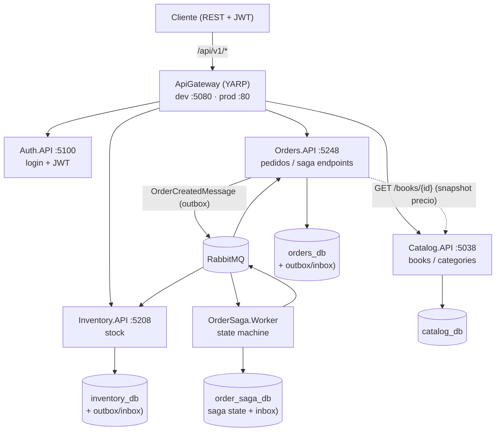
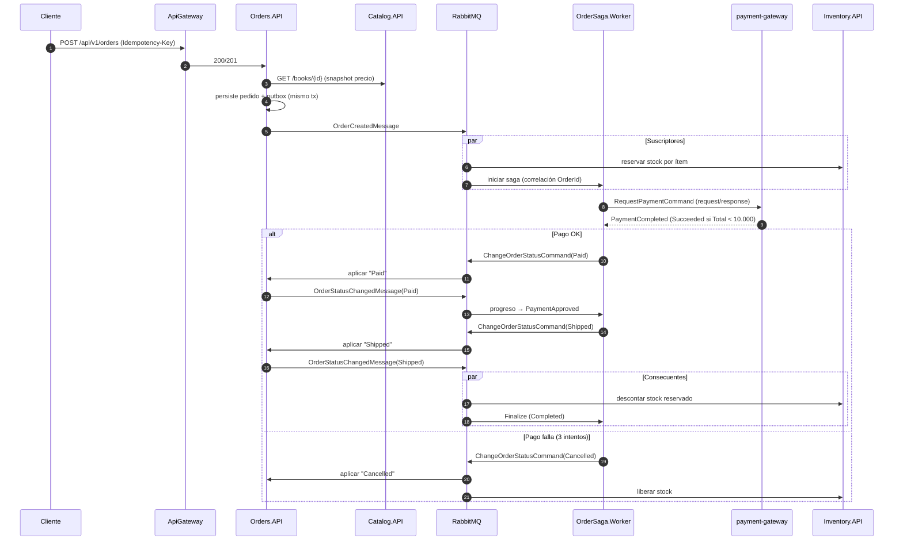
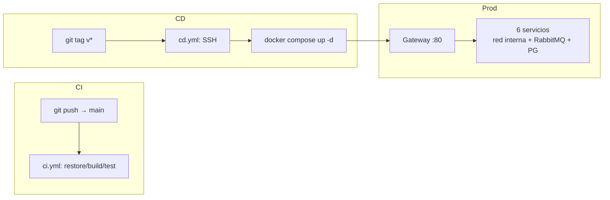

# Arquitectura — bookstore-microservices

| | |
|---|---|
| **Estado** | En evolución (activo) |
| **Fecha** | 2026-08-29 |
| **Propietario** | Richard Rodriguez |
| **Contacto** | fam.castro99@gmail.com |
| **Enlaces** | [README](../README.md) · [CONTRIBUTING](../CONTRIBUTING.md) · [CHANGELOG](../CHANGELOG.md) · [SECURITY](../SECURITY.md) |

## 1. Resumen ejecutivo

Plataforma de librería online compuesta por **5 servicios** (4 APIs + 1 worker de saga) y un **gateway único**, construida en .NET 10 con Clean Architecture. El proceso central —la **orden de compra**— se orquesta mediante una **saga distribuida** sobre RabbitMQ con patrón **outbox/inbox** transaccional, garantizando consistencia eventual sin pérdida ni duplicado de mensajes.

Objetivos arquitectónicos: un único punto de entrada, desacople por mensajería, idempotencia en los puntos de fallo, resiliencia (reintentos/circuit breaker) y observabilidad end-to-end (trazas + métricas).

## 2. Principios de diseño

1. **Contratos antes que implementación**: las APIs se consumen por contratos HTTP (`/api/v1/*`) y los servicios se desacoplan por mensajes tipados (`SharedKernel.Messages`).
2. **Dependencias hacia dentro** (Clean Architecture): Domain → Application → Infrastructure → API; nunca al revés.
3. **Fallo de mensajería ≠ pérdida de datos**: transactional outbox/inbox; los consumidores son idempotentes.
4. **Deliverability**: reintentos exponenciales y circuit breaker para llamadas HTTP salientes.
5. **Observable por defecto**: OpenTelemetry (trazas) y `/metrics` (Prometheus) en todos los servicios.
6. **Entornos reproducibles**: esquema auto-migrado por EF, infraestructura por Docker y despliegues por pipeline (CI/CD).

## 3. Vista de alto nivel

## 4. Componentes

| Componente | Rol | Puerta de entrada |
|---|---|---|
| **ApiGateway** | Punto único de entrada (YARP), enrutado y reescritura de destinos | `:5080` dev / `:80` prod (único puerto público) |
| **Auth.API** | Emisión y validación de JWT | `/api/v1/auth/*` |
| **Catalog.API** | Catálogo de libros y categorías | `/api/v1/books/*`, `/api/v1/categories/*` |
| **Orders.API** | Creación y estados de pedidos, productor/consumidor de mensajes | `/api/v1/orders/*` |
| **Inventory.API** | Stock: reserva, descuento y liberación | `/api/v1/stock-items/*` |
| **OrderSaga.Worker** | Saga de pedidos + **payment-gateway** (consumidor simulado) | sin HTTP (worker) |
| **RabbitMQ** | Broker de mensajería | `:5672` (gestión `:15672`) |
| **PostgreSQL** | 4 bases (una por servicio con datos) | `:5432` |

## 5. Enrutado del gateway (YARP)

Rutas definidas en `src/ApiGateway/appsettings.json` (todas con prefijo `/api/v1`):

| Ruta | Cluster (servicio) | Destino |
|---|---|---|
| `/api/v1/books/{**catch-all}` | `catalog` → `catalog-1` | `http://catalog:5038/` *(prod)* |
| `/api/v1/categories/{**catch-all}` | `catalog` | ídem |
| `/api/v1/orders/{**catch-all}` | `orders` → `orders-1` | `http://orders:5248/` |
| `/api/v1/stock-items/{**catch-all}` | `inventory` → `inventory-1` | `http://inventory:5208/` |
| `/api/v1/auth/{**catch-all}` | `auth` → `auth-1` | `http://auth:5100/` |

En el stack de producción las direcciones se inyectan por entorno (`ReverseProxy__Clusters__*__Destinations__*__Address`), porque dentro del *overlay network* de Docker los contenedores se resuelven por **nombre de servicio**, no por `localhost`.

## 6. Comunicación síncrona

Solo hay una llamada síncrona significativa: al crear un pedido, **Orders.API consulta a Catalog.API** (`GET /books/{id}`) para validar el libro y **hacer snapshot del precio** en el pedido (configurable en `CatalogApi__BaseAddress`). El pedido almacena su propio `Total`/`Currency` para no depender del catálogo a futuro.

- Resiliente: `Microsoft.Extensions.Http.Resilience` (reintentos exponenciales + circuit breaker).
- El resto de interacciones entre servicios es asíncrona por RabbitMQ (diseño orientado a eventos).

## 7. Mensajería y contratos

Todos los contratos viven en `src/BuildingBlocks/SharedKernel/Messages/OrderMessages.cs` (registros inmutables). **APIs públicas del bus**:

| Mensaje | Publica | Consumen | Propósito |
|---|---|---|---|
| `OrderCreatedMessage(OrderId, CustomerId, Total, Currency, OccurredOn, Items)` | Orders (creación) | Saga (inicio) + Inventory (reserva) | Comunicar pedido creado |
| `OrderStatusChangedMessage(OrderId, CustomerId, OldStatus, NewStatus, OccurredOn, Items)` | Orders (transición de estado) | Saga (progreso) + Inventory (descuento/liberación) | Comunicar cambio de estado |
| `RequestPaymentCommand(OrderId, Amount, Currency)` | Saga → `queue:payment-gateway` | payment-gateway | Solicitar cargo (request/response, timeout 0) |
| `PaymentCompleted(OrderId, Succeeded, Reason)` | payment-gateway | Saga | Resultado del pago |
| `ChangeOrderStatusCommand(OrderId, NewStatus)` | Saga | Orders | Ordenar cambio de estado |

Topología de consumidores:

- **Orders.API**: `ChangeOrderStatusCommandConsumer` → `UpdateOrderStatusCommand`.
- **Inventory.API**: `OrderCreatedConsumer` (**reserva** cada item) y `OrderStatusChangedConsumer` (**descuenta** en `Shipped`, **libera** en `Cancelled`).
- **OrderSaga.Worker**: `OrderSagaStateMachine` en `OrderCreatedMessage` y `OrderStatusChangedMessage`; `PaymentGatewayConsumer` atiende `RequestPaymentCommand`.

## 8. Saga de pedido

Orquestación en `OrderSaga.Worker/OrderSagaStateMachine.cs`, persistida en `order_saga_db` (tabla `saga-state`) y correlacionada por `OrderId`. Estados: `AwaitingPayment → PaymentApproved → ShipmentRequested → Completed` (o `Cancelled`), con hasta **3 intentos de pago**.

El **payment-gateway es simulado** (`PaymentGatewayConsumer`): duerme 250 ms y responde `Succeeded` si `Amount < 10.000`.

Reglas de negocio que condicionan la arquitectura:

- **Reserva temprana**: el stock se reserva al *crear* el pedido (no al pagar) y se libera si se **cancela**.
- **Descuento**: solo al pasar a `Shipped`.
- **Estados**: `Pending → Paid → Shipped` (compra) o `Pending → Cancelled`.
- La compensación (liberar stock) es automática vía `OrderStatusChangedMessage(Cancelled)`.

## 9. Outbox / Inbox (MassTransit)

- **Outbox transaccional**: al guardar el agregado se persisten los mensajes en `OutboxMessage` dentro de la **misma transacción** que el pedido; MassTransit los entrega tras el commit (no hay ventana sin mensaje).
- **Inbox**: los consumidores deduplican mensajes (idempotencia *at least once*) vía `InboxState`, evitando efectos laterales duplicados (p. ej. doble descuento de stock).
- Tablas sufijadas por base: Orders (Creación/Órdenes), Inventory e OrderSaga tienen su propio outbox/inbox; la saga usa además `saga-state`.

→ El contrato de mensajes es un **convenio estable**: modificarlo es breaking y requiere versión + ADR (ver [CONTRIBUTING](../CONTRIBUTING.md#mensajería-y-sagas)).

## 10. Resiliencia

- **HTTP (Orders→Catalog)**: reintentos exponenciales + circuit breaker (`Microsoft.Extensions.Http.Resilience`).
- **Mensajería**: reintento interno del bus + redelivery; además retry del pago (hasta 3) en la saga.
- **Idempotencia**: consumidores idempotentes + header `Idempotency-Key` en la creación de pedidos (ver §11).

## 11. Idempotencia en la creación de pedidos

`POST /api/v1/orders` acepta `Idempotency-Key` (GUID) en el encabezado:

1. 1.ª vez con una clave → **201** y pedido persistido con su `IdempotencyKey` (índice único).
2. Retry con la misma clave → **200**, devolviendo el **mismo pedido** (sin duplicar).
3. Sin clave → se genera un GUID internamente.

Garantiza que reintentos de red por timeout no dupliquen pedidos ni reservas.

## 12. Seguridad y autenticación

- **JWT HMAC-SHA256**: `Auth.API` emite tokens (credenciales demo `admin/admin123`, `customer/customer123`); el resto de servicios validan por firma (`Jwt__Issuer`, `Jwt__Audience`, `Jwt__SigningKey`).
- **Roles**: `admin`/`customer` con políticas de autorización (`AdminOnly` para operaciones de inventario y otras protegidas).
- **Secrets**: claves y contraseñas de producción nunca en `appsettings.json` (ver SECURITY/CONTRIBUTING); catálogo no requiere token para lectura.
- El reverse-proxy expone únicamente `/api/v1/*`.

## 13. Persistencia

4 bases PostgreSQL 17, ownership por servicio (*database per service*):

| Base | Servicio | Particularidad |
|---|---|---|
| `catalog_db` | Catalog.API | 1 migración |
| `orders_db` | Orders.API | 2 migraciones (+ idempotencia, outbox/inbox) |
| `inventory_db` | Inventory.API | 2 migraciones (+ outbox/inbox) |
| `order_saga_db` | OrderSaga.Worker | 1 migración (saga state + inbox) |

- Cada Base aplica **`db.Database.Migrate()` al arrancar** (migraciones automáticas); el script `docker/postgres/init/001-create-databases.sql` crea las bases en entornos limpios.
- El dominio de inventario modela `QuantityOnHand`, `ReservedQuantity` y `Available`.

## 14. Observabilidad

- **Trazas**: OpenTelemetry (OTLP) `OpenTelemetry__Endpoint` (dev `http://localhost:4317`) → **Jaeger** (`:16686`).
- **Métricas**: `/metrics` (Prometheus) scraped cada 10 s (targets de los 5 servicios dev) → **Grafana** (`:3000`, `admin/admin`, datasource provisionado).
- Instrumentación disponible: HTTP (ASP.NET Core), System.Net.Http, MassTransit, Npgsql y EF Core.

## 15. Despliegue

Dos modos de ejecución equivalentes (no duplicados):

- **Dev** (iteración): 6 procesos `dotnet run` en puertos dedicados + contenedores de infraestructura (`bookstore-postgres`, `bookstore-rabbitmq`, y opcional observabilidad por `docker-compose.observability.yml`).
- **Prod** (`docker/docker-compose.prod.yml`): 9 contenedores con Postgres/RabbitMQ propios en red interna; **único puerto público `:80`** (gateway). Los destinos YARP se inyectan por variables de entorno.

**CI/CD** (`../../.github/workflows/`):
- `ci.yml`: en cada push/PR a `main` → `dotnet restore` + `build` + `test` (unit + integración con Testcontainers).
- `cd.yml`: al crear un tag `v*` → SSH al servidor → `docker compose build` + `up -d` (requiere secrets `SERVER_HOST`, `SERVER_USER`, `SSH_PRIVATE_KEY`, `vars.DEPLOY_DIR`).

## 16. Limitaciones y roadmap

- **Payment-gateway simulado** (éxito si `Total < 10.000`): sustituible por un proveedor real sin cambiar la saga (mismo contrato `RequestPaymentCommand`/`PaymentCompleted`).
- **Sin CORS configurado**: el cliente web futuro (SPA) deberá añadir origin en el gateway.
- **Catálogo sin mensajería** de momento; Auth no usa base de datos.
- Pendientes: **ADR** de las decisiones clave (`docs/adr/`), contratos versionados y *contract testing*, y frontend (React/Vue/Blazor) consumiendo el gateway.

## 17. Decisiones de arquitectura (ADR)

Las decisiones registrarán en `docs/adr/` (`adr-NNNN-título.md`). Candidatas próximas: motor de saga (MassTransit + EF), patrón outbox/inbox, reserva temprana de stock, idempotencia por header y auto-migraciones.

## 18. Referencias

- [README](../README.md) — quickstart, puertos, config y entorno.
- [CONTRIBUTING](../CONTRIBUTING.md) — estándares, migraciones y testing.
- [CHANGELOG](../CHANGELOG.md) — historial de cambios.
- Fuentes clave: `src/ApiGateway/appsettings.json`, `src/BuildingBlocks/SharedKernel/Messages/OrderMessages.cs`, `src/Services/OrderSaga/OrderSaga.Worker/OrderSagaStateMachine.cs`, consumidores en `Inventory.API/Consumers` y `Orders.API/Consumers`.